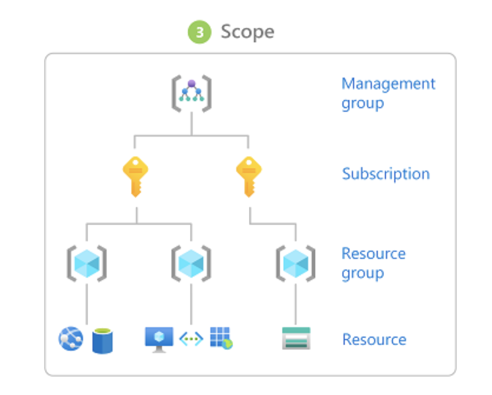

# IAM (Identity and Access Management) Role Based Access Controls (RBAC)

* Azure role-based access control (Azure RBAC) is a system that provides fine-grained 
 access management of Azure resources. Using Azure RBAC, you can segregate duties within your team
 and grant only the amount of access to users that they need to perform their jobs.
 Ex: ``` Allow a DBA group to manage SQL databases in a subscription
 Allow an application to access all resources in a resource group ```
 A role assignment is the process of attaching a role definition to a user, group, service principal, or managed identity 
 at a particular scope for the purpose of granting access. Access is granted by creating a role assignment,
 and access is revoked by removing a role assignment.
 
* Permission in Azure is based on Roles. Role is a collection of permissions i.e what a user can
perform actions on a given Azure resource like read/write/delete access to a VM, network etc.
Ex: The Virtual Machine Contributor role allows a user to create and manage virtual machines.
If the built-in roles don't meet the specific needs of your organization, you can create your
own Azure custom roles. 

* Scope: Scope is the set of resources that the access applies to. 
When you assign a role, you can further limit the actions allowed by defining a scope. 
This is helpful if you want to make someone a Website Contributor, but only for one resource group.
Scopes are structured in parent-child relationship which means the permissions are inherited from parent to child.
If the parent has access then child will also have access.


## The following are the high-level steps that Azure RBAC uses to determine if you have access to a resource.

These steps apply to Azure Resource Manager or data plane services integrated with Azure RBAC.
This is helpful to understand if you are trying to troubleshoot an access issue.

1. A user (or service principal) acquires a token for Azure Resource Manager. 
The token includes the user's group memberships (including transitive group memberships).

1. The user makes a REST API call to Azure Resource Manager with the token attached.
1. Azure Resource Manager retrieves all the role assignments and deny assignments that apply to the resource upon which the action is being taken.
1. If a deny assignment applies, access is blocked. Otherwise, evaluation continues.
1. Azure Resource Manager narrows the role assignments that apply to this user or their group and determines what roles the user has for this resource.
1. Azure Resource Manager determines if the action in the API call is included in the roles the user has for this resource. If the roles include Actions that have a wildcard (*), the effective permissions are computed by subtracting the NotActions from the allowed `Actions`.
 Similarly, the same subtraction is done for any data actions.
`Actions` - `NotActions` = Effective management permissions
`DataActions` - `NotDataActions` = Effective data permissions

1. If the user doesn't have a role with the action at the requested scope, access is not allowed. Otherwise, any conditions are evaluated.
1. If the role assignment includes conditions, they are evaluated. Otherwise access is allowed.
1. If conditions are met, access is allowed. Otherwise access is not allowed.
 
 
 
## Where is Azure RBAC data stored?

Role definitions, role assignments, and deny assignments are stored globally to ensure that you have access to your resources regardless of the region you created the resource.
When a role assignment or any other Azure RBAC data is deleted, the data is globally deleted. Principals that had access to a resource via Azure RBAC data will lose their access.

## Why is Azure RBAC data global?

Azure RBAC data is global to ensure that customers can timely access resources regardless from where they are accessing.
Azure RBAC is enforced by Azure Resource Manager, which has a global endpoint and requests are routed to the nearest region for speed and resilience.
Therefore, Azure RBAC must be enforced in all regions and the data is replicated to all regions. For more information, see Resiliency of Azure Resource Manager.
 
## Azure Built-in Roles


 
## References:
* https://docs.microsoft.com/en-us/azure/role-based-access-control/
* https://docs.microsoft.com/en-us/azure/role-based-access-control/best-practices
* https://docs.microsoft.com/en-us/azure/role-based-access-control/troubleshooting

