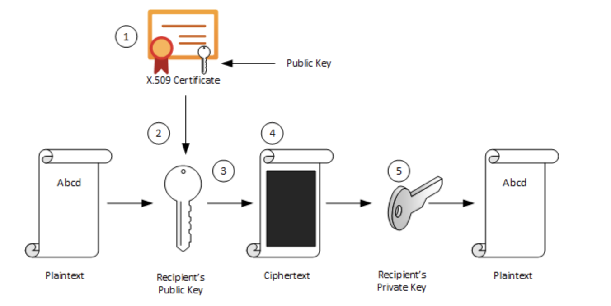

# Public Key Infrastructure (PKI), X.509 certificates, SSL/TLS 

A certificate is a digital document that contains the device's public key and can be used to verify that the device is what it claims to be. 
* `Algorithms` define how original plaintext data is transformed into ciphertext and back to plaintext.
* `Keys` are random or pseudorandom data strings used as input to an algorithm.
* `Certificates` are digital documents that contain an entity's public key and enable you to determine whether the subject of the certificate is who or what it claims to be.
* `Certification Authorities` attest to the authenticity of certificate subjects.

## Symmetric Key Encryption
* All parties uses the same private key to encrypt and decrypt data. Private key is shared by all parties and therefore 
poses a single point of failure if an attacker gets hold of the key. The symmetric key must be securely transmitted to the recipient.
Sending the key is the greatest security risk when using a symmetric algorithm.

## Asymmetric Key Encryption

In asymmetric cryptography, every user has two mathematically related keys called a key pair. One key is public and the other key is private. 
The key pair ensures that only the recipient has access to the private key needed to decrypt the data.

1. The recipient creates a public-private key pair and sends the public key to a CA. The CA packages the public key in an X.509 certificate.
1. The sending party obtains the recipient's public key from the CA.
1. The sender encrypts plaintext data using an encryption algorithm. The recipient's public key is used to perform encryption.
1. The sender transmits the ciphertext to the recipient. It isn't necessary to send the key because the recipient already has the private key needed to decrypt the ciphertext.
1. The recipient decrypts the ciphertext by using the specified asymmetric algorithm and the private key.

### Signing

Digital signing can be used to determine whether the data has been modified in transit or at rest. The data is passed through a hash algorithm, a one-way function that produces a mathematical result from the given message. 
The result is called a hash value, message digest, digest, signature, or thumbprint. 
A hash value cannot be reversed to obtain the original message. Because A small change in the message results in a significant change in the thumbprint, the hash value can be used to determine whether a message has been altered.

