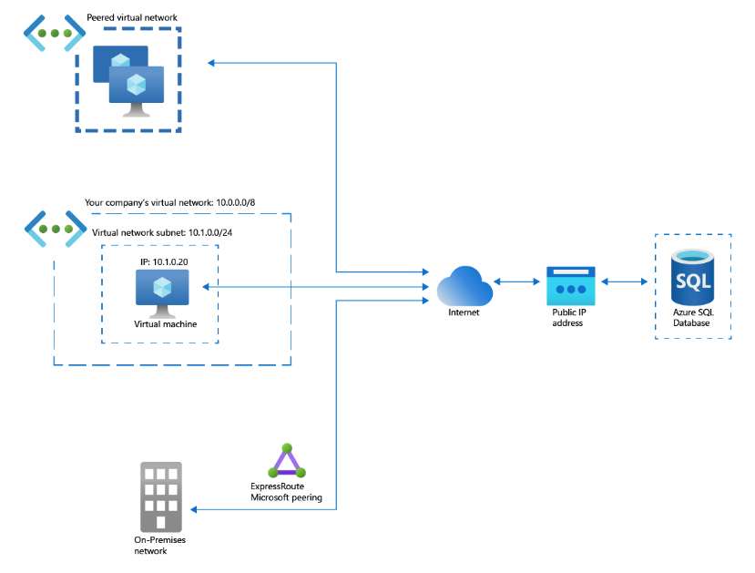
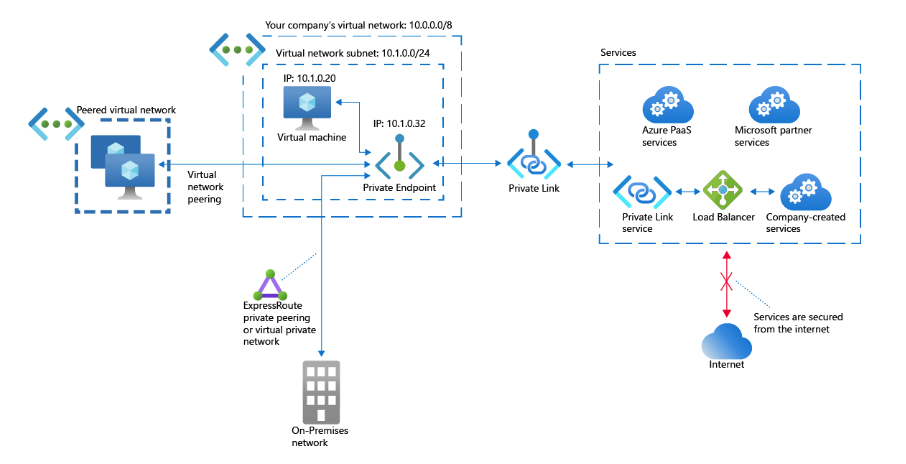
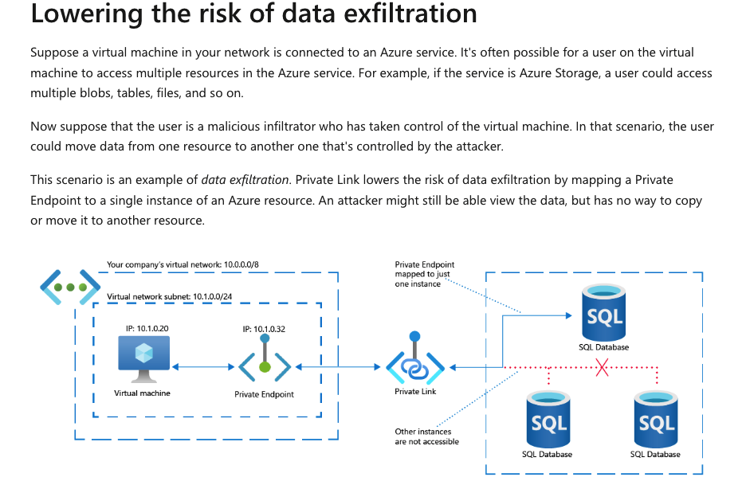

## AWS PrivateLink, Azure Private Link, GCP private access

### Azure Private Link

Azure Private Link enables you to access Azure PaaS Services (for example, Azure Storage and SQL Database) 
and Azure hosted customer-owned/partner services over a private endpoint in your virtual network.
Traffic between your virtual network and the service travels the Microsoft backbone network. Exposing your service to the public internet is 
no longer necessary. You can create your own private link service in your virtual network and deliver it to your customers.

Benefits:
1. Privately access services on the Azure platform
1. Protection against data leakage
1. Global reach: reach compute/storage in any region privately.
1. Extend to your own services, access your custom service privately.

### Private link traffic flow

#### Non Pe Traffic

Traffic flows uses internet to reach specific Azure service

#### PE Traffic

Traffic flow does not use internet to reach Azure service instead uses internal IP mapping to reach specific Azure service.

1. More secure, Eliminating internet exposure for PaaS services for ex: when you are backing up your data to Azure Storage you dont want your data to go through internet instead you would want it get replicated 
using azure networking within the cloud.
1. Securing traffic between your company network and the Azure cloud

#### Data exfiltration

